# DevMind

AI Software Engineering Platform

> "Understand, analyze, explain, detect, and improve your codebase with AI."

DevMind is a comprehensive, production-grade **AI Software Engineering Platform** designed to understand, analyze, reason, detect vulnerabilities, evaluate change blast radiuses, generate regression tests, and author verified pull requests on GitHub.

Unlike prompt wrappers or naive file-replacement tools, DevMind keeps the developer in complete control of every code change through interactive diff previews, stale patch validation, Security Gate checks, allowlisted test execution, and rigorous AI verification.

---

## 1. Overview

### Why DevMind Exists
Modern software development requires deep context: understanding repository-wide dependencies, avoiding breaking API contracts, maintaining security guardrails, and validating fixes with comprehensive tests. 

DevMind connects **static code analysis**, **logical AST semantic chunking**, **vector RAG retrieval**, **2D graph topology reasoning**, and **multi-agent AI automation** into a unified engineering control plane.

### End-to-End AI Engineering Workflow

```
                ISSUE DETECTED
                      ↓
            CONTEXT RETRIEVAL (RAG)
                      ↓
            IMPACT ANALYSIS (Blast Radius)
                      ↓
               AI FIX AGENT
                      ↓
            UNIFIED DIFF PREVIEW
                      ↓
            SECURITY GATE CHECK
                      ↓
          AI TEST GENERATION (4 Scenarios)
                      ↓
          CONTROLLED TEST EXECUTION
                      ↓
            AI FIX VERIFICATION
                      ↓
            DEVELOPER APPROVAL
                      ↓
           APPLY TARGETED PATCH
                      ↓
          CREATE ISOLATED GIT BRANCH
                      ↓
               CREATE COMMIT
                      ↓
         GITHUB PULL REQUEST AUTOMATION
```

---

## 2. Key Features

- **GitHub Integration & OAuth**: Connect GitHub accounts, browse public and private repositories, and clone repository trees with branch switching.
- **Repository Knowledge Base & RAG**: Discovers source code, ignores build/binary artifacts, chunks files by logical AST symbols (functions, classes, components, routes), and creates vector embeddings stored in MongoDB with cosine similarity search.
- **Multi-Agent AI Architecture**:
  - **Bug Agent**: Detects null/undefined dereferences, broken async/await, race conditions, and logic errors.
  - **Security Agent**: Audits OWASP Top 10 vulnerabilities, auth bypasses, and sanitizes secrets (`API_KEY=********`).
  - **Architecture Agent**: Detects circular dependencies, god modules, and coupling bottlenecks using graph topology.
  - **Test Agent**: Uncovers test coverage gaps, unhandled boundary conditions, and generates test suites.
  - **Performance Agent**: Detects N+1 query patterns, blocking loops, and memory leaks.
  - **Fix Agent**: Generates targeted, minimal code modifications with diff preview and Security Gate validation.
  - **Verification Agent**: Evaluates whether a proposed fix truly resolves an issue without creating side effects.
- **Evidence-First AI Reasoning**: Every finding and chat response is grounded with exact line-range citations (`controllers/authController.js:42-71`) and match percentages. If context is insufficient, the system safely reports uncertainty instead of hallucinating.
- **Impact Analysis & Blast Radius**: Calculates direct callers, transitive downstream cascades (BFS), affected API routes, and test suites with AI risk explanations.
- **5-Mode AI Chat**: Specialized modes for `Codebase RAG`, `Architecture`, `Security`, `Debugging`, and `General AI` with instant RAG re-indexing and interactive evidence drawers.
- **AI Fix Agent & Unified Diff Preview**: Generates minimal targeted patches, renders line-by-line colored diffs (`+` / `-`), runs Security Gate checks, and guards against stale patches.
- **Comprehensive Test Generation**: Detects project test frameworks (`Jest`, `Vitest`, `Mocha`, `Pytest`, `JUnit`) and authors 4 mandatory scenarios:
  1. Regression test
  2. Happy path test
  3. Edge case test
  4. Error / invalid input test
- **Controlled Test Execution Engine**: Sandboxed runner executing allowlisted commands (`npm test`, `pytest`, `mvn test`) with duration tracking, pass/fail counts, and AI test failure diagnosis.
- **Pull Request Automation & PR Readiness**: Evaluates a 5-checkpoint PR Readiness score and authors verified GitHub PRs with structured Markdown descriptions.
- **Audit Trail & Rollback**: Complete engineering activity log with rollback/discard capabilities for uncommitted session changes.

---

## 3. System Architecture

```mermaid
flowchart TD
    DEV([Developer / User])

    subgraph CLIENT [Frontend - React 19 + Vite + Tailwind]
        DASH[Command Center Dashboard]
        ARCH_VIEW[2D Architecture Force Graph]
        CHAT_VIEW[5-Mode AI Chat & Evidence Drawer]
        IMPACT_VIEW[Impact Analysis & Blast Radius UI]
        SEC_VIEW[Security Intelligence & Agent Audit]
        FIX_VIEW[AI Fix Workspace & Diff Preview]
        TEST_VIEW[Test Generator & Execution Runner]
        PR_VIEW[PR Readiness & GitHub Automation]
    end

    subgraph SERVER [Backend - Node.js + Express API]
        AUTH_SVC[Auth & JWT Middleware]
        GH_SVC[GitHub OAuth & Git Tree API]
        ANALYSIS_SVC[Analysis & Code Review Engine]
        ARCH_SVC[Architecture Graph & Topology Engine]
        IMPACT_SVC[Impact Analysis & BFS Traversal Engine]
        
        subgraph RAG_PIPELINE [RAG Knowledge Base Pipeline]
            CHUNKER[Logical AST Chunking Service]
            EMBED_SVC[Embedding Service + Fallback]
            VEC_STORE[Vector Store Abstraction]
            RETRIEVAL_SVC[Semantic Retrieval & Context Builder]
        end

        subgraph AGENT_SYSTEM [Multi-Agent AI Orchestration]
            ORCHESTRATOR[Agent Orchestrator]
            BUG_AGT[Bug Agent]
            SEC_AGT[Security Agent & Redactor]
            ARCH_AGT[Architecture Agent]
            TEST_AGT[Test Agent]
            PERF_AGT[Performance Agent]
            FIX_AGT[AI Fix Agent & Security Gate]
            VERIFY_AGT[Verification Agent & PR Readiness]
        end

        TEST_RUNNER[Allowlisted Test Execution Runner]
        GEMINI_SVC[Gemini AI Service with Retry & Fallback Chain]
    end

    subgraph STORAGE [Persistent Storage - MongoDB]
        MONGO[(MongoDB Database)]
        COLL_USERS[(Users)]
        COLL_REPOS[(Repositories)]
        COLL_ANALYSES[(Analyses)]
        COLL_ARCH[(Architecture Graphs)]
        COLL_CHUNKS[(Code Chunks & Embeddings)]
        COLL_RUNS[(Agent Runs & Findings)]
        COLL_AUDIT[(Audit Action Logs)]
    end

    DEV --> CLIENT
    CLIENT --> SERVER
    SERVER --> MONGO

    GH_SVC --> CHUNKER
    CHUNKER --> EMBED_SVC
    EMBED_SVC --> VEC_STORE
    VEC_STORE --> COLL_CHUNKS
    VEC_STORE --> RETRIEVAL_SVC

    RETRIEVAL_SVC --> CHAT_VIEW
    RETRIEVAL_SVC --> FIX_AGT
    RETRIEVAL_SVC --> ORCHESTRATOR

    ORCHESTRATOR --> BUG_AGT & SEC_AGT & ARCH_AGT & TEST_AGT & PERF_AGT
    FIX_AGT --> GEMINI_SVC
    VERIFY_AGT --> GEMINI_SVC
    GEMINI_SVC --> ORCHESTRATOR

    FIX_AGT --> GH_SVC
    TEST_RUNNER --> VERIFY_AGT
    VERIFY_AGT --> PR_VIEW
    SERVER --> COLL_AUDIT
```



---

## 4. Repository Architecture

```
DevPlatform/
├── client/
│   ├── src/
│   │   ├── components/          # Sidebar, Navbar, StatCard, CreatePrModal, Skeletons, MarkdownRenderer
│   │   ├── context/             # AuthContext, ToastContext
│   │   ├── hooks/               # useAuth, useGithubConnection, useAnalysisPoller
│   │   ├── layouts/             # AuthLayout, DashboardLayout
│   │   ├── pages/               # Dashboard, Repositories, Architecture, Chat, ImpactAnalysis,
│   │   │                        # Security, Tests, AiFixes, PullRequests, Settings, AnalysisResult
│   │   ├── routes/              # ProtectedRoute, App routing setup
│   │   ├── services/            # api, authService, githubService, analysisService,
│   │   │                        # knowledgeService, agentService, impactService, engineeringService
│   │   ├── App.jsx              # Main React App routing root
│   │   ├── index.css            # Dark mode tokens & CSS utilities
│   │   └── main.jsx             # React DOM entry point
│   ├── package.json             # React 19, Vite, Tailwind CSS, react-force-graph-2d
│   └── vite.config.js           # Vite configuration
│
├── server/
│   ├── src/
│   │   ├── config/              # env.js, db.js
│   │   ├── controllers/         # authController, githubController, analysisController,
│   │   │                        # architectureController, chatController, knowledgeController,
│   │   │                        # agentController, impactController, engineeringController, systemController
│   │   ├── middleware/          # authMiddleware (protect, authorize), errorHandler
│   │   ├── models/              # User, Repository, Analysis, ArchitectureGraph, CodeChunk, AgentRun, AuditLog
│   │   ├── routes/              # authRoutes, githubRoutes, analysisRoutes, architectureRoutes,
│   │   │                        # chatRoutes, knowledgeRoutes, agentRoutes, impactRoutes, engineeringRoutes
│   │   ├── services/            # authService, githubService, analysisService, architectureService,
│   │   │                        # chunkingService, embeddingService, vectorStore, retrievalService,
│   │   │                        # knowledgeService, agentOrchestrator, impactService, fixAgentService,
│   │   │                        # testRunnerService, verificationAgentService, geminiService
│   │   ├── utils/               # ApiError, fileFilters, jwt helpers
│   │   └── app.js               # Express app configuration
│   ├── test/                    # 5 test suites (34 tests)
│   │   ├── architectureService.test.js
│   │   ├── geminiRobustness.test.js
│   │   ├── prGenerator.test.js
│   │   ├── part2Platform.test.js
│   │   └── part3Engineering.test.js
│   ├── server.js                # Server entry point
│   ├── package.json             # Express, Mongoose, Axios, Helmet, Bcrypt
│   └── .env.example             # Server environment variables
│
└── README.md                    # Complete project documentation
```

---

## 5. AI Multi-Agent Architecture

| Agent | Responsibility | Input Context | Finding Output | Evidence Standard |
|---|---|---|---|---|
| **Bug Agent** | Null pointer risks, broken async/await, race conditions, edge-case conditions | Logical function & component code chunks | Title, description, severity, confidence, recommendation, fix | Exact line range & problematic snippet |
| **Security Agent** | Injection (SQL/NoSQL/Command), Auth/RBAC bypasses, CORS, cookies, secrets | Route handlers, auth middleware, sensitive modules | Title, severity, confidence, OWASP category, recommendation | Sanitized lines with secrets redacted (`API_KEY=********`) |
| **Architecture Agent** | Circular dependencies, god modules, dependency bottlenecks, separation of concerns | `ArchitectureGraph` topology, nodes, degrees, cyclic links | Architectural issue, severity, affected files, fix strategy | Direct graph edge and dependency trace |
| **Test Agent** | Test coverage gaps, untested business workflows, boundary conditions | Service methods, calculation utilities, model schemas | Missing test scenarios, suggested test suites, assertions | Exact file & signature requiring tests |
| **Performance Agent** | N+1 queries in loops, synchronous blocking calls in async routes, memory leaks | Data access layers, loops, heavy compute functions | Performance bottleneck, severity, optimization strategy | Code snippet of loop/query pattern |
| **Fix Agent** | Generates minimal targeted patches with Security Gate checks and diff previews | Issue, file content, RAG chunks, impact blast radius | Full proposed content, unified diff, security check | Line-by-line diff (`+`/`-`) with fresh SHA validation |
| **Verification Agent** | Rigorously determines whether code modifications resolved the root cause | Original issue, original code, modified code, test results | `RESOLVED`, `PARTIALLY_RESOLVED`, `NOT_RESOLVED` | Critical reasoning & remaining risks analysis |

---

## 6. RAG Knowledge Base Pipeline

```
GitHub Tree / Blobs → Path Filtering → Incremental SHA-256 Hash → Logical AST/Symbol Chunker → Batch Embeddings → MongoDB VectorStore → Cosine Similarity Search → Context Builder → Gemini 2.5
```
- **AST/Symbol Chunking**: Parses JS/TS/JSX/TSX, Python, Java, C/C++, JSON, YAML, and Markdown by functions, classes, React components, and Express routes.
- **Incremental Caching**: SHA-256 file hashes skip unchanged files on re-indexing.
- **Resilience**: Features normalized deterministic embedding fallback so the platform remains operational in offline or rate-limited environments.

---

## 7. Impact Analysis & Blast Radius

- Calculates **Direct Callers** (1st degree) and **Indirect Downstream Modules** via BFS queue traversal up to 6 levels deep.
- Identifies **Affected API Endpoints** (`routes`, `controllers`) and **Affected Test Suites** (`*.test.*`, `*.spec.*`, `__tests__`).
- Computes risk score & level (`Low`, `Medium`, `High`, `Critical`) with sensitivity boost if touching auth, user models, or database schemas.
- Invokes Gemini to produce an architectural explanation, breaking change risks, and verification checklist.

---

## 8. Security Intelligence & Security Gate

- **OWASP Auditing**: Evaluates codebases against SQL/NoSQL injection, XSS, CSRF, insecure CORS, cookie attributes, and authentication bypasses.
- **Secret Redaction**: Masks API keys (`AIza...`), GitHub tokens (`ghp_...`), JWT secrets, and bearer headers (`API_KEY=********`).
- **Fix Security Gate**: Pre-screens all AI-generated code patches before preview or application for dangerous `eval()`, command injection, and unparameterized queries.

---

## 9. AI Fixes, Diff Preview & Test Execution

1. **Targeted Fix Generation**: AI generates minimal patches instead of blind file rewrites.
2. **Unified Diff Viewer**: Visualizes added lines in green (`+`), removed lines in red (`-`), and context lines in gray.
3. **Stale Patch Protection**: Re-fetches the file from GitHub and checks that its SHA/content matches before applying (returns 409 if modified).
4. **4-Scenario Test Generation**: Generates Regression, Happy Path, Edge Case, and Error Handling tests tailored to the project framework.
5. **Allowlisted Test Runner**: Sandboxed runner executing `npm test`, `pytest`, `mvn test`, etc., capturing stdout, stderr, duration, and pass/fail counts.
6. **AI Diagnosis**: Diagnoses root causes if a test fails.

---

## 10. AI Chat Modes

1. **Codebase RAG Mode**: Grounds answers with exact file paths and line ranges (`file.js:10-35`).
2. **Architecture Mode**: Injects `ArchitectureGraph` topology data (nodes, links, bottlenecks, cycles).
3. **Security Mode**: Prioritizes route guards, auth middleware, and vulnerability analysis.
4. **Debugging Mode**: Evaluates error handlers, recent static analysis issues, and call chains.
5. **General AI Mode**: Broad software engineering guidance.

---

## 11. Tech Stack

### Frontend
- **Framework**: React 19 (`19.2.8`)
- **Build Tool**: Vite 8 (`8.2.0`)
- **Styling**: Vanilla CSS + Tailwind CSS 3 (`3.4.19`) with dark-mode tokens
- **Graph Visualization**: `react-force-graph-2d` (`1.29.1`)
- **Routing**: React Router DOM (`7.18.2`)
- **HTTP Client**: Axios (`1.19.0`)
- **Linting**: Oxlint (`1.75.0`)

### Backend
- **Runtime**: Node.js
- **Framework**: Express (`4.19.2`)
- **Database**: MongoDB with Mongoose (`8.5.0`)
- **Security**: Helmet (`7.1.0`), CORS (`2.8.5`), Cookie-Parser (`1.4.6`), BcryptJS (`2.4.3`)
- **Auth**: JSON Web Tokens (`jsonwebtoken 9.0.2`)
- **AI Integration**: Google Gemini API (`gemini-2.5-flash`, `gemini-2.0-flash` fallback, `text-embedding-004`)
- **Testing**: Node.js Native Test Runner (`node:test`)

---

## 12. API Architecture

| Method | Endpoint | Description | Auth Required |
|---|---|---|---|
| `GET` | `/api/health` | API health check | No |
| `POST` | `/api/auth/register` | User registration | No |
| `POST` | `/api/auth/login` | User login & JWT issuance | No |
| `GET` | `/api/auth/me` | Fetch authenticated profile | Yes |
| `POST` | `/api/auth/logout` | User logout & cookie invalidation | Yes |
| `GET` | `/api/github/connect` | Initiate GitHub OAuth handshake | Yes |
| `GET` | `/api/github/callback` | GitHub OAuth callback | No |
| `GET` | `/api/github/repositories` | List user's GitHub repositories | Yes |
| `POST` | `/api/github/connect-repo` | Connect repository for analysis | Yes |
| `POST` | `/api/analysis/:repositoryId/run` | Execute Gemini code analysis | Yes |
| `GET` | `/api/analysis/:repositoryId/status` | Poll real-time analysis progress | Yes |
| `GET` | `/api/analysis/:repositoryId/latest` | Fetch latest analysis report | Yes |
| `GET` | `/api/analysis/:repositoryId/history` | List analysis history runs | Yes |
| `POST` | `/api/analysis/result/:analysisId/issues/:issueId/create-pr` | Create branch PR on GitHub | Yes |
| `POST` | `/api/analysis/result/:analysisId/share` | Generate public share token | Yes |
| `GET` | `/api/shared/:shareToken` | Public view for shared analysis | No |
| `GET` | `/api/architecture/:repositoryId` | Fetch or compute architecture graph | Yes |
| `POST` | `/api/architecture/:repositoryId/explain` | AI explanation of architecture | Yes |
| `POST` | `/api/knowledge/:repositoryId/index` | Index repository into RAG knowledge base | Yes |
| `GET` | `/api/knowledge/:repositoryId/status` | Check RAG indexing status and chunk count | Yes |
| `POST` | `/api/knowledge/:repositoryId/query` | Test semantic vector search directly | Yes |
| `POST` | `/api/chat/:repositoryId` | Multi-mode AI chat with evidence citations | Yes |
| `POST` | `/api/agents/:repositoryId/run` | Execute multi-agent audit | Yes |
| `GET` | `/api/agents/:repositoryId/runs` | Fetch past agent run records | Yes |
| `POST` | `/api/security/:repositoryId/analyze` | Dedicated Security Agent audit | Yes |
| `POST` | `/api/impact/:repositoryId` | Calculate blast radius and AI explanation | Yes |
| `GET` | `/api/impact/:repositoryId/files` | List analyzable dependency files | Yes |
| `POST` | `/api/engineering/:repositoryId/generate-fix` | Generate AI Fix Proposal with diff & Security Gate | Yes |
| `POST` | `/api/engineering/:repositoryId/validate-fix` | Validate fix freshness against repository (stale check) | Yes |
| `POST` | `/api/engineering/:repositoryId/apply-fix` | Apply approved fix to isolated Git branch | Yes |
| `POST` | `/api/engineering/:repositoryId/generate-tests` | Generate 4-scenario comprehensive unit test suite | Yes |
| `POST` | `/api/engineering/:repositoryId/run-tests` | Execute allowlisted test runner | Yes |
| `POST` | `/api/engineering/:repositoryId/verify-fix` | Run Verification Agent on fix + test results | Yes |
| `POST` | `/api/engineering/:repositoryId/diagnose-failure` | AI root cause diagnosis of test errors | Yes |
| `GET` | `/api/engineering/:repositoryId/audit-trail` | Fetch repository engineering activity timeline | Yes |
| `POST` | `/api/engineering/:repositoryId/pr-readiness` | Calculate PR readiness scorecard | Yes |
| `POST` | `/api/engineering/:repositoryId/revert` | Rollback / discard session changes | Yes |

---

## 13. Environment Variables

### Backend (`server/.env`)

```env
# Server Configuration
NODE_ENV=development
PORT=5000
CLIENT_URL=http://localhost:5173

# Database Connection
MONGO_URI=mongodb://localhost:27017/devplatform

# Authentication Secrets
JWT_SECRET=your_long_random_jwt_secret_here
JWT_EXPIRES_IN=7d
JWT_COOKIE_EXPIRES_DAYS=7

# GitHub OAuth Integration
GITHUB_CLIENT_ID=your_github_oauth_client_id
GITHUB_CLIENT_SECRET=your_github_oauth_client_secret
GITHUB_CALLBACK_URL=http://localhost:5000/api/github/callback

# Google Gemini AI Integration
GEMINI_API_KEY=your_google_gemini_api_key
GEMINI_MODEL=gemini-2.5-flash
GEMINI_FALLBACK_MODEL=gemini-2.0-flash
GEMINI_EMBEDDING_MODEL=text-embedding-004
```

### Frontend (`client/.env`)

```env
VITE_API_BASE_URL=http://localhost:5000/api
```

---

## 14. Local Development Setup

### 1. Backend Setup

```bash
cd server
cp .env.example .env
# Fill in MONGO_URI, JWT_SECRET, and GEMINI_API_KEY
npm install
npm run dev
```

*Backend runs on `http://localhost:5000`.*

### 2. Frontend Setup

```bash
cd client
cp .env.example .env
npm install
npm run dev
```

*Frontend runs on `http://localhost:5173`.*

### 3. Run Backend Test Suites

```bash
cd server
npm test
```

*Runs 34 tests across 5 test suites covering architecture extraction, Gemini fallback, PR generation, AST chunking, vector math, Security Gate, and allowlisted test execution.*

---

## 15. Security & Safety Model

- **Zero Unprompted Modifications**: Code is never modified or pushed to GitHub without explicit developer preview and approval.
- **Strict Secret Masking**: Credentials, tokens, and private keys are redacted (`API_KEY=********`).
- **Command Allowlisting**: Only verified, safe test commands (`npm test`, `pytest`, `mvn test`) can be executed.
- **Stale Patch Guards**: Compares file SHA hashes before committing to prevent applying stale patches.
- **Branch Isolation**: All fixes and tests are written to dedicated `devmind/fix/...` branches, never directly to `main`.

---

## 16. Project Roadmap

### Implemented ✅
- [x] Full-stack MERN platform with GitHub OAuth
- [x] Gemini AI code review with transient error retry and model fallback
- [x] 2D force-directed architecture graph with 9 categories & cycle detection
- [x] Engineering Command Center Dashboard with 5 Health Pillars
- [x] RAG Knowledge Base with AST/Symbol Chunking & VectorStore
- [x] Multi-Agent Orchestrator (Bug, Security, Architecture, Test, Performance, Fix, Verification)
- [x] 5-Mode AI Chat with Evidence Citations Drawer
- [x] Impact Analysis & Reverse Dependency BFS Traversal
- [x] AI Fix Agent, Security Gate & Unified Diff Preview
- [x] 4-Scenario Test Generator & Allowlisted Test Runner
- [x] Verification Agent & PR Readiness Scorecard
- [x] GitHub Branch & Pull Request Automation
- [x] Audit Action Trail & Session Rollback

### Planned Future Capabilities 🚀
- [ ] Multi-repository cross-service dependency mapping
- [ ] Real-time WebSocket streaming for AI agent logs
- [ ] Automated CI/CD GitHub Actions bot commenting on open PRs
- [ ] Custom team architecture rules and compliance linter

---

## 17. Contributing

1. Fork the repository.
2. Create a feature branch: `git checkout -b feature/amazing-feature`.
3. Run tests: `cd server && npm test` and `cd client && npm run build`.
4. Commit and push: `git push origin feature/amazing-feature`.
5. Open a Pull Request.

---

## 18. License

This project is licensed under the MIT License — see the [LICENSE](LICENSE) file for details.
